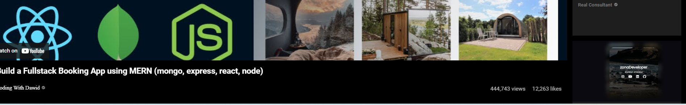

# Material-UI Tutorial

Hi there! Welcome to my project repository where I explore the wonderful world of Material-UI and its integration with React. My name is Anilraj Lokku, and I'm excited to share my journey with you.

## Overview

This repository is dedicated to creating a YouTube clone project using React and Material-UI. I've been following tutorials from the YouTube Code Evolution channel to learn how to build sleek and modern user interfaces with Material-UI.

## Getting Started with Create React App

To kickstart this project, I used Create React App, a popular toolchain for building React applications with no build configuration required. It provides a smooth development experience and allows me to focus on writing code rather than setting up the build environment.

## What is Material-UI?

Material-UI is a React UI framework that follows Google's Material Design guidelines. It offers a comprehensive set of pre-designed components, icons, and styles that enable developers to create visually appealing and responsive user interfaces. With Material-UI, I can quickly build professional-looking applications while adhering to best design practices.

### Key Features of Material-UI:

- **Pre-designed Components:** Material-UI provides a wide range of ready-to-use components such as buttons, cards, dialogs, and more, saving developers valuable time and effort.
- **Theming Support:** It offers robust theming capabilities, allowing developers to customize the appearance of their applications to match their brand or design preferences.
- **Responsive Design:** Material-UI components are designed to be mobile-friendly and adapt seamlessly to different screen sizes, ensuring a consistent user experience across devices.

## Used Package Managers

For managing dependencies and project configurations, I utilized two popular package managers: NPM and Yarn. Both NPM and Yarn offer similar functionalities, allowing me to install, update, and remove packages easily. I chose to use these package managers for their reliability and extensive package ecosystems.

# Rapid API Integration

In addition to exploring Material-UI, I also integrated Rapid API into my project to leverage its vast collection of APIs for various functionalities.

## What is Rapid API?

Rapid API is a leading API marketplace that provides developers with access to thousands of APIs from different categories, including social media, finance, weather, and more. By using Rapid API, I can easily integrate powerful functionalities into my applications without having to build them from scratch.

### Key Benefits of Rapid API:

- **Wide Range of APIs:** Rapid API offers a diverse selection of APIs covering various domains, allowing developers to find solutions for their specific needs.
- **Easy Integration:** Integrating APIs from Rapid API is straightforward, thanks to its user-friendly interface and comprehensive documentation.
- **Community Support:** Rapid API has a vibrant community of developers who share their experiences, code snippets, and best practices, making it easier for newcomers to get started and troubleshoot issues.

## Deployment To Netlify

To showcase my project to the world, I deployed it to Netlify, a popular platform for hosting static websites and web applications. Netlify provides seamless integration with Git repositories, automatic deployment pipelines, and powerful features for managing custom domains and SSL certificates.

## `npm run build`

Before deploying the project to production, I ran the `npm run build` command to generate optimized production-ready assets. This command bundles the React application, minifies JavaScript files, and optimizes assets for better performance, resulting in faster load times and improved user experience.

# Output Images

To provide a visual representation of the project, I included screenshots of the YouTube clone application. These images showcase various aspects of the user interface, including the video player, channel details, and likes section.

