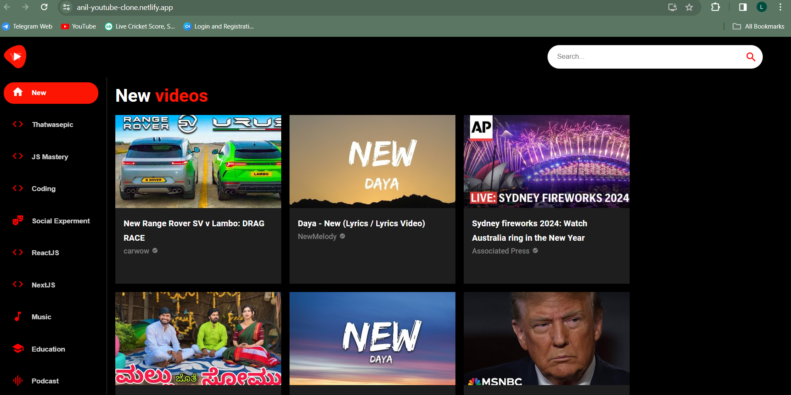

# Material-UI Tutorial

Hi, I'm Anilraj Lokku. This repository is Used to make a project on youtube-clone that I learned from the YouTube Code Evolution channel.

# Getting Started with Create React App

This project was bootstrapped with [Create React App](https://github.com/facebook/create-react-app).

# Used Technologies

React
Material-Ui
Rapid- Api

## What is Material-UI?

Material-UI is a popular open-source React UI framework that implements Google's Material Design guidelines. It provides a set of pre-designed React components that developers can use to build user interfaces quickly and efficiently.

# Used Package Managers

NPM
YARN

### Deployment To Netifly

This section has moved here: [https://anil-youtube-clone.netlify.app/](https://anil-youtube-clone.netlify.app/)

## `npm run build`

Builds the app for production to the `build` folder.\
It correctly bundles React in production mode and optimizes the build for the best performance.

# OutPut Image

